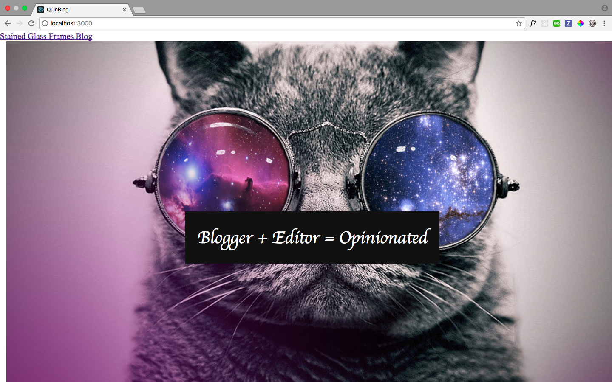

# Blogging It

## Synopsis:
The motivation behind this project was to merge the benefits of React on the front-end 
with the benefits of Rails on the back-end. This is the result a Blogger site built with React-Rails.




## Code Example
```````````Code in erb/React-Rails
  <%=react_component 'Article', {article: @article} %>


<%= link_to 'Edit', edit_article_path(@article) %> |
<%= link_to 'Back', articles_path %>

<%=react_component 'Comment', {comment: @article.comments} %>

<h2>Add a comment:</h2>
<%= render 'comments/form' %>

  ```````````
## Build Strategy
I approached the process by building a Ruby on Rails application and then 
converting some of the views into React. I wanted to keep the benefits of Rails with its url helpers 
and use React on the show views of the comments and articles.

## Technologies

For this project, I have used the following technologies:

* Ruby on Rails
* React
* React-Rails
* SASS
* GitHub

## Future Improvements (not in any particular order)

1. Add more styling for the erb views
2. Convert more views to React


## Contributing
* Stack Overflow 
* W3 Schools
* Rails Documentation
* React-Rails Docs


These resources really helped. 

##Authors
Shantel Moore


